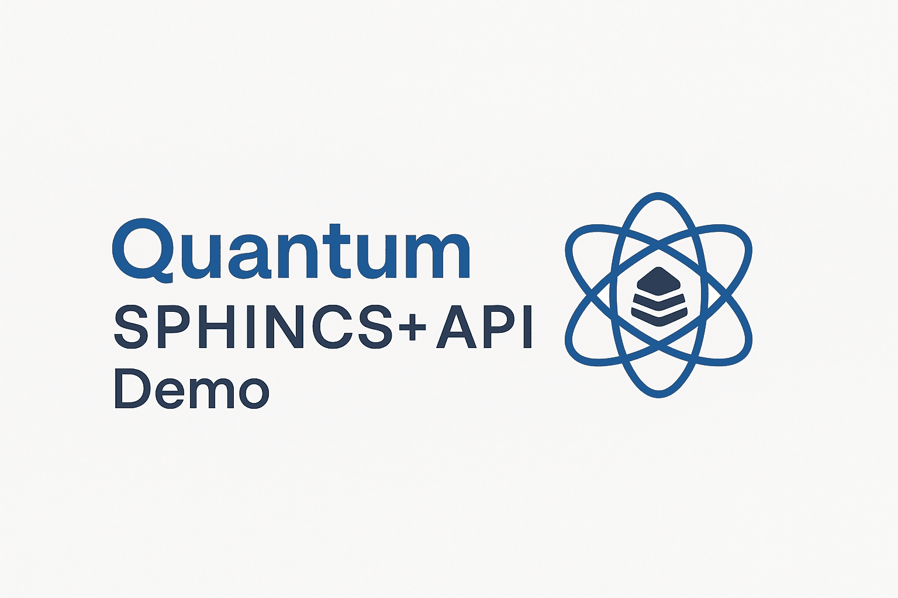

<p align="left">
  <a href="https://github.com/brunoleomenezes/quantum_sphincs_api_demo">
    
  </a>
</p>

# Quantum SPHINCS+ API Demo

[](LICENSE)
[](https://doi.org/10.5281/zenodo.15336618)
[](https://www.python.org/)
[](https://github.com/sphincs/sphincsplus)

This repository demonstrates the integration of the **SPHINCS+** post-quantum digital signature algorithm with simulated quantum attacks using **Qiskit**.

The project includes:

- Quantum circuit simulations using GHZ states, Grover’s algorithm, and entanglement.
- Seamless integration between native C execution and Python scripting.
- Evaluation of signature integrity in quantum simulation contexts.
- A ready-to-use REST API for automation in local or cloud environments.

## Repository Structure

```
quantum_sphincs_api_demo/
├── external/                # SPHINCS+ Submodule (https://github.com/sphincs/sphincsplus.git)
├── src/
│   ├── c_tests/             # C tests with CMocka
│   └── quantum_attacks/    # Python scripts with Qiskit
├── LICENSE
├── .gitignore
└── README.md
```

## Cloning the Repository

```bash
git clone --recurse-submodules https://github.com/brunoleomenezes/quantum_sphincs_api_demo.git
cd quantum_sphincs_api_demo
```

## Environment Setup

### Dependencies

- GCC
- Python 3.12
- Qiskit
- CMocka
- OpenSSL

For Fedora-based systems (as used in the study):

```bash
sudo dnf install gcc python3 python3-devel cmocka-devel openssl-devel
pip install qiskit
```

## Compiling SPHINCS+

```bash
cd external/sphincsplus/ref
make
```

## Running C Tests (Locally)

```bash
cd src/c_tests
make
./tests
```

## Running Quantum Simulations (Locally)

```bash
cd src/quantum_attacks
python quantum_attack_ghz.py
python quantum_attack_4_qubits.py
python quantum_attack_grover.py
```

## API for Integration and Automation

This project provides a **complete REST API**.

| Method | Endpoint | Description |
|--------|----------|-------------|
| GET | `/` | Checks if the API is online |
| GET | `/run_c_tests` | Runs SPHINCS+ C tests locally |
| GET | `/run_attack/ghz` | Runs GHZ |
| GET | `/run_attack/4qubits` | Runs 4-qubit |
| GET | `/run_attack/grover` | Runs Grover's  |
| GET | `/run_attack/all` | Runs all |

#### CURL Example

```bash
curl https://your-domain-or-railway.app/run/ghz
```

## Updating the SPHINCS+ Submodule

```bash
git submodule update --remote --merge
git add .gitmodules external/sphincsplus
git commit -m "Update SPHINCS+ submodule"
git push origin main
```

## License

This project is licensed under the **Academic Non-Commercial License v1.0**. See the [LICENSE](LICENSE) file for details.

## Credits

- **Bruno Leonardo Santos Menezes**
- **Franklin de Lima Marquezino**
- **Claudio Miceli de Farias**

[DOI: 10.5281/zenodo.15336618](https://doi.org/10.5281/zenodo.15336618)

---

This project is part of a scientific study focused on the evaluation of post-quantum algorithms and is under continuous development.
